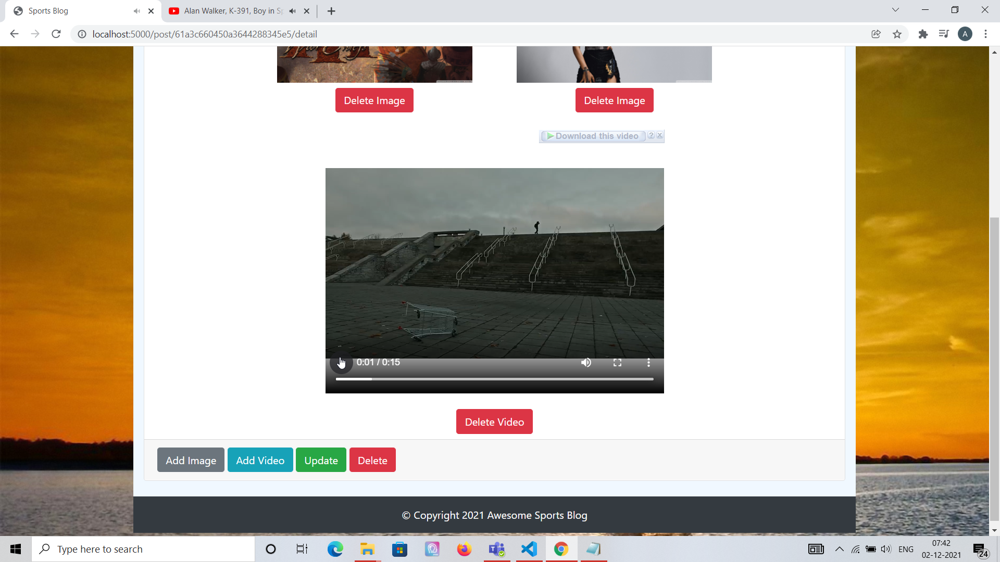
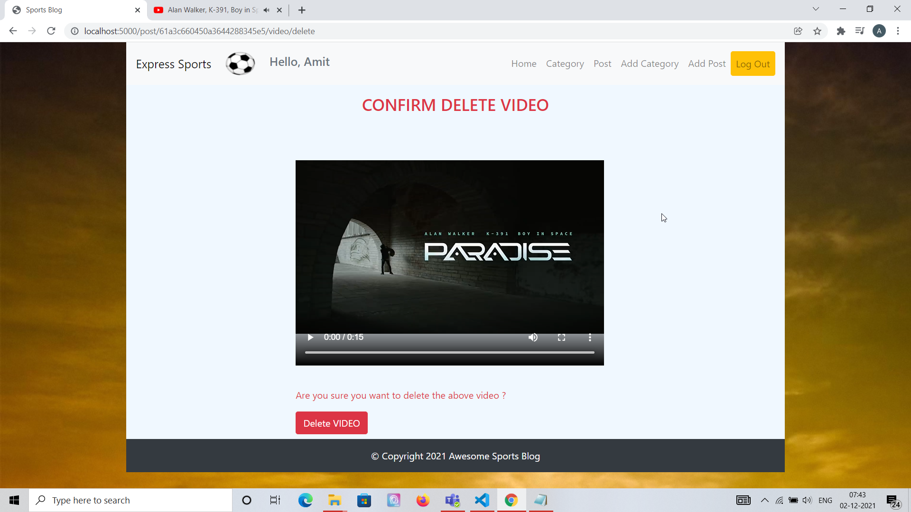
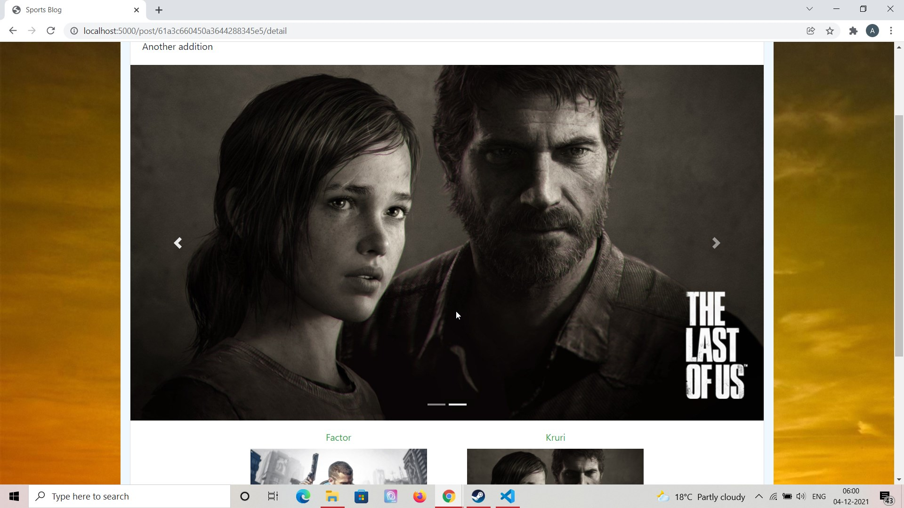

# Express Sports Blog - A Blogging Application in Express ⚡️

## Project Briefing

This is a Blogging application for writing sports based articles. You can categorize your posts based on different sports. The project is themed around Sports but can be easily generalized to include posts from other categories as well. It is created in Express and uses EJS Template engine, it uses MongoDB and Mongoose for database.

Made with ❤️ by **[@apfirebolt](https://github.com/Apfirebolt/)**
## Features

- Multi page application which uses EJS Express Template Engine.
- Contains session based user auth system using Passport.js
- Each user can perform CRUD on Sports Blog Categories.
- Each category could have multiple posts inside of it with fully functional CRUD operations.
- Bootstrap is used for UI components. 

## Built With

* [Express](https://expressjs.com/)
* [EJS Express Templates](https://ejs.co/)
* [MongoDB](https://www.mongodb.com/)
* [Mongoose](https://mongoosejs.com/)
* [Bootstrap](https://getbootstrap.com/)

## Project setup

Simply install node modules for backend. The project does not have a separate frontend as of now but might have in future. Make sure you have MongoDB installed and running on your system, you can also have it running inside a Docker container. Of course, you'd need you have Node and NPM environment configured on your system.

```
npm install
npm start
```

## Database Architecture

- MongoDB is used as database which works pretty smoothly with Javascript and other Javascript frameworks. 
- Mongoose ORM is used to define document schemas and perform 
complex queries.
- It has 3 models namely 'User', 'Blog' and 'Post'.
- No nested document approach as been adopted, instead Object references are used by establishing Foreign key relationship where ever required within the application.

## Production Deployment

- Docker containers are used for deploying this.
- You can own a virtual server or configure your ECS AWS instances with Docker and Docker Compose to deploy this.
- Internal network of containers is created through Docker Compose which would link Nginx, Express and MongoDB all running on separate containers.
- Change env variables accordingly otherwise, connection establishment to MongoDB running inside a container would fail.

## Future Requirements

- Comments functionality to be added to each post.
- Adding images to each post.
- Profile Settings of the logged in user.
- Adding video with each post (DONE).

## Updates

- Adding videos to post functionality completed, only a single video can be added to each post. Screenshots have been added for the same, max size for the video you can upload is 10 MB.

## Testing

- Adding automated testing using Mocha, Chai and Sinon

## Project Screenshots

Please find some of the screenshots of the application. Below is the screenshot of the Register Page.


Login Page.


Add Post, posts can be added within category. CRUD on Posts is supported.


Screenshot below shows list of posts.


Screenshot below shows list of categories


Screenshot below shows the added video being played on the post detail page.



Screenshot below delete video screen where you can delete the video you added to a post. Direct update for now is not supported, you'd have to delete the video previously associated with a post to add a new video to the post.



###### Update : 

Carousel functionality for the gallery section was added recently. Below is the screenshot of it.



